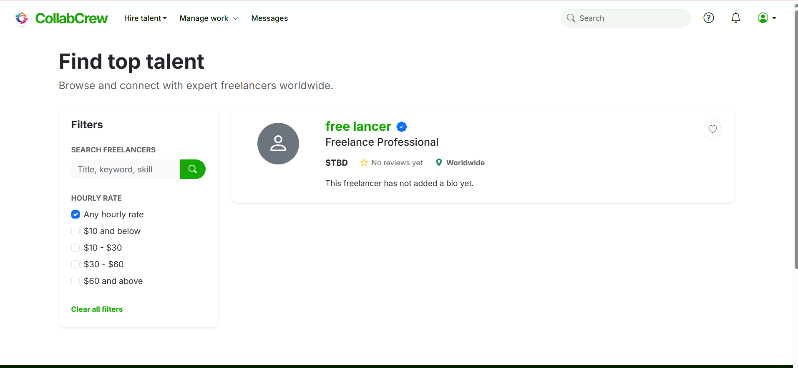
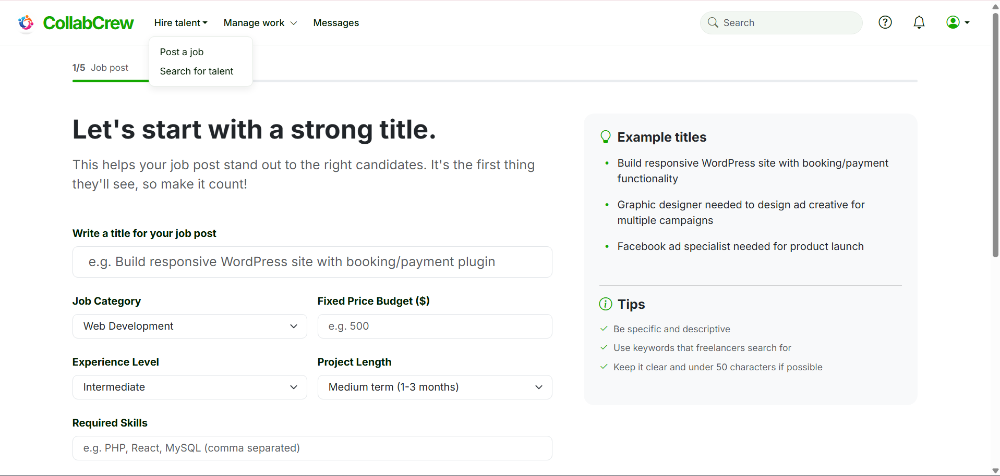

  
  
  
  

  <h1>🤝 CollabCrew</h1>
  
A professional, two-sided freelance talent marketplace built natively in PHP and MySQL.

  
  <strong><a href="https://elegant-prosperity-production-3c20.up.railway.app">🚀 View Live Demo</a></strong>

---

## 📖 Overview
CollabCrew is heavily inspired by the modern UI and architecture of Upwork. It provides a seamless ecosystem for **Clients** to post jobs and hire talent, and **Freelancers** to bid on projects and build their professional reputation.

## 📸 Platform Previews

  
  
<em>Modern, responsive landing page designed to attract top talent and clients</em>

  
  
<em>Robust Job Feed with dynamic querying and real-time updates</em>

  
  
<em>Client Dashboard for managing postings and reviewing proposals</em>

  
  
<em>Detailed Proposal Submission System</em>

  
  
<em>Secure direct messaging between Client and Hired Freelancer</em>

---

## ✨ Key Features

### 🔄 Dual-Sided Unified Accounts
- Users can seamlessly switch between **Client mode** (posting jobs, hiring) and **Freelancer mode** (submitting proposals, finding work) from a single account.
- Complete settings dashboard to update Professional Titles, Bios, and Hourly Rates.

### 📝 Advanced Proposal System
- Freelancers submit detailed **Proposals** including a custom cover letter, specific bid amount, and estimated delivery timeline.
- Clients get a visually rich dashboard to review these proposals, compare bid amounts, and officially **Hire** the best candidate.

### 💬 Built-in Communication & Reviews
- **Direct Messaging**: Once a proposal is accepted, an exclusive chat interface opens up for direct collaboration.
- **Review System**: When a client marks a project as "Completed", they must leave a 1-5 star rating and comment, firmly attaching feedback to the Freelancer's public profile.

---

## 🛠️ Architecture & Under the Hood

### The Database Hierarchy 
Built with a highly normalized, relational MySQL schema using **Foreign Key Cascading**. This ensures absolute data integrity:
> *If a user deletes their account, all their projects, proposals, active contracts, and messages are instantly purged from the system.*

### Environment Agnostic Setup (`db.php`)
The database connection handles fallback detection intelligently. By utilizing environment variables (`getenv()`), the code works perfectly on **both** a Local XAMPP environment and a Cloud Production environment (like Railway) without altering a single line of code.

### Tech Stack
*   **Frontend**: HTML5, CSS3, Bootstrap 5 (Customized Green/White Upwork theme), Bootstrap Icons
*   **Backend**: PHP 8.1+ (Session management, secure prepared statements for SQL injection prevention)
*   **Database**: MySQL (Relational tables)
*   **Deployment**: Railway (Containerized Nixpacks build)

---

## 🚀 Running the Project

### Local Development (XAMPP/MAMP)
Refer to the `STARTUP_GUIDE.md` included in this repository for step-by-step local setup instructions.

### Cloud Deployment
Configured out-of-the-box for [Railway.app](https://railway.app/).
1. Connect this repo to Railway via the `deployment` branch.
2. Spin up a MySQL service and inject the variables: `MYSQLHOST`, `MYSQLUSER`, `MYSQL_ROOT_PASSWORD`, `MYSQL_DATABASE`.
3. The `composer.json` ensures the `ext-mysqli` driver is built at runtime.
